# Thiago Feijó Ramos

## 🚀 About Me
I’m a passionate React developer focused on building performant, maintainable, and scalable front-end applications. Over the years, I’ve worked extensively with React in various contexts, including micro frontends, design systems, component libraries, and CI/CD automation.

I hold the OpenJS Node.js Application Developer certification, which reflects my solid understanding of backend development and the broader JavaScript ecosystem.

Throughout my career, I’ve worked with tools like Redux, Formik, D3, Leaflet, and various testing frameworks. I care deeply about clean code, developer experience, and building efficient, scalable solutions.

React is more than just a library to me, it’s a passion. I genuinely enjoy working with it and am always eager to explore its possibilities further.

## 💻 Skills & Expertise

### Coding Languages:
| Language   |                                                                                                                | Language   |                                                                                                               |
|-------------|--------------------------------------------------------------------------------------------------------------------|--------------|----------------------------------------------------------------------------------------------------------------------|
|JavaScript|  |CSS| | 
|PowerShell|  |Shell| |
|C#|  |Python| |
|HTML| |

## 📫 How to reach me:

```mermaid
flowchart LR
    direction LR
    subgraph 1[" "]
        direction TB
        top1[Find Thiago's Profile] --> bottom1[Hire Thiago 🤝]
    end
    subgraph 2[" "]
        direction TB
        top2[Google Endlessly 🔎] --> bottom2[Waste Time ⌛]
    end

    %% Link to subgraph1
    3[Discover Problem 🐛] --> 1

    %% Link within subgraph2
    3[Discover Problem 🐛] --> 2

    1 --> outside1["Profit" 📈]
    2 --> outside2["Cry" 😢]

    click top1 "hhttps://www.linkedin.com/in/thiagofeijodev/" "LinkedIn"

    style 1 stroke:#072ff7,stroke-width:5px
    style 2 stroke:#f70707,stroke-width:5px
```

